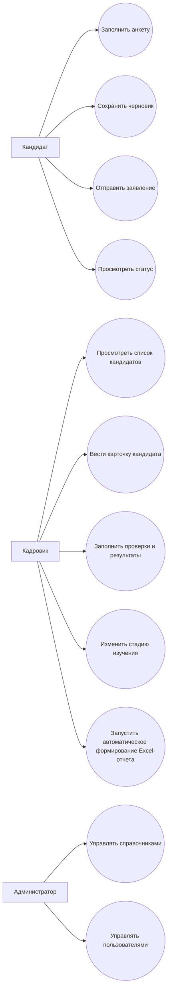
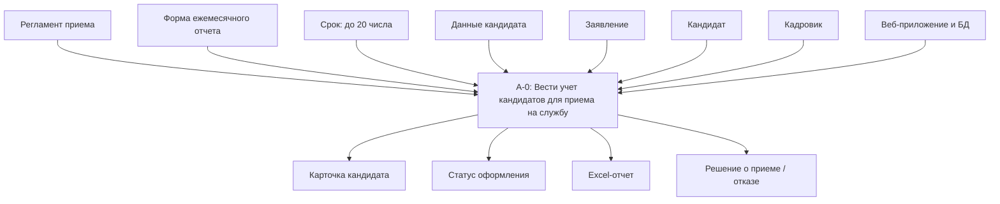
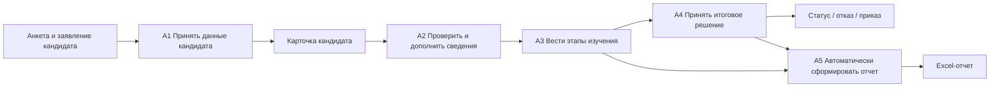
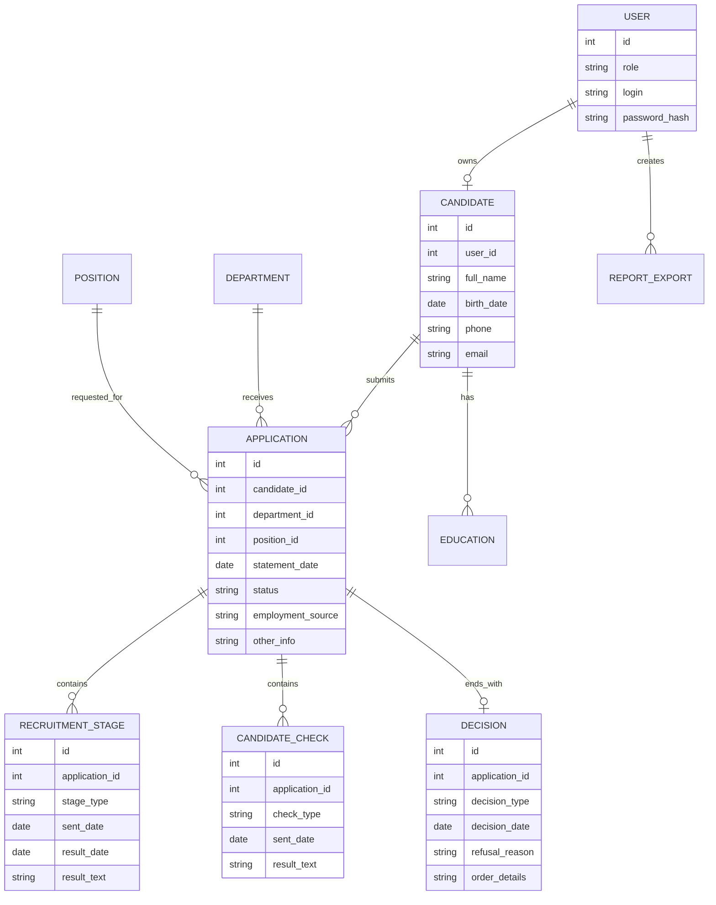

# Концепция приложения по работе с кандидатами

## 1. Что есть в Excel-шаблоне

Файл `Ежемесячный_отчет_до_20_числа_по_кандидатам.xlsx` является мониторингом работы с кандидатами для приема на службу. В таблице 31 колонка:

| Блок | Поля |
|---|---|
| Идентификация записи | № п/п, дата заявления, стадия изучения |
| Данные кандидата | ФИО, дата рождения, образование, источник сведений о трудоустройстве |
| Подразделение и должность | подразделение МВД, начальствующий состав, категория, должность, служба |
| Этапы изучения | дата утверждения задания, УП/УР, испытания, ВВК, ППО |
| Проверки | ИЦ, ГИАЦ, ОРЧ СБ, ФСБ, ГИБДД, БСТМ, СООП, УВМ, диплом, допуск к СГТ |
| Итог | отказ, приказ о приеме / направление в УРЛС, иные сведения |

Главная особенность: не все поля должен заполнять кандидат. Персональные данные и первичную анкету заполняет кандидат, а служебные этапы, проверки, результаты и приказ заполняет сотрудник кадрового подразделения.

## 2. Что лучше: сайт или приложение

Лучший вариант - веб-приложение.

Причины:

- кандидату удобно открыть форму по ссылке без установки программы;
- кадровик может работать с заявками из браузера;
- можно разграничить роли: кандидат, кадровик, администратор;
- проще сделать автоматический экспорт в `.xlsx`, который будет открываться в Excel и повторять существующий шаблон;
- данные можно хранить централизованно, а не пересылать отдельные файлы.

Рекомендуемая структура: веб-сайт с личной формой кандидата и административной частью для кадровика.

## 3. Роли

| Роль | Возможности |
|---|---|
| Кандидат | заполнить анкету, сохранить черновик, отправить заявление, посмотреть статус |
| Кадровик | просматривать кандидатов, заполнять этапы изучения, результаты проверок, менять статус, запускать автоматическое формирование отчета |
| Администратор | управлять пользователями, справочниками, подразделениями, должностями |

## 4. Структура приложения

### 4.1. Часть кандидата

Страницы:

- вход / регистрация кандидата;
- анкета кандидата;
- выбор источника информации о трудоустройстве;
- сведения об образовании;
- желаемое подразделение и должность;
- подтверждение и отправка заявления;
- страница статуса заявления.

Основные поля кандидата:

- ФИО;
- дата рождения;
- уровень и вид образования;
- источник получения сведений о возможности трудоустройства;
- подразделение / территориальный орган;
- желаемая должность;
- контактные данные;
- дополнительные сведения.

### 4.2. Часть кадровика

Страницы:

- список кандидатов;
- карточка кандидата;
- вкладка "Основные сведения";
- вкладка "Этапы изучения";
- вкладка "Проверки";
- вкладка "Результат";
- автоматическое формирование ежемесячного отчета в Excel.

Основные действия кадровика:

- принять анкету в работу;
- указать стадию: `на оформлении`, `принят на службу`, `отказ`;
- заполнить даты направления и результаты проверок;
- указать причину отказа;
- указать реквизиты приказа;
- запустить автоматическое формирование отчета до 20 числа.

## 5. Use Case

### 5.1. Диаграмма Use Case



### 5.2. Основные сценарии

| ID | Use Case | Актор | Результат |
|---|---|---|---|
| UC-01 | Заполнение анкеты | Кандидат | Создана анкета кандидата |
| UC-02 | Сохранение черновика | Кандидат | Данные сохранены без отправки кадровику |
| UC-03 | Отправка заявления | Кандидат | Заявка получает статус `на оформлении` |
| UC-04 | Ведение карточки | Кадровик | По кандидату заполнены этапы изучения |
| UC-05 | Заполнение проверок | Кадровик | Зафиксированы даты направлений и результаты |
| UC-06 | Принятие решения | Кадровик | Указан итог: принят, отказ или продолжает оформление |
| UC-07 | Автоматическое формирование отчета | Кадровик | Система сама сформировала Excel-файл по шаблону |
| UC-08 | Управление справочниками | Администратор | Обновлены подразделения, должности, категории |

## 6. IDEF0

### 6.1. Контекстная диаграмма A-0

Функция: `Вести учет кандидатов для приема на службу`.

| Тип стрелки | Содержание |
|---|---|
| Вход | данные кандидата, заявление кандидата |
| Управление | требования к отчету, регламент приема, сроки формирования отчета до 20 числа |
| Выход | карточка кандидата, статус оформления, Excel-отчет, решение о приеме или отказе |
| Механизм | кандидат, кадровик, администратор, веб-приложение, база данных |



### 6.2. Декомпозиция A0

| Блок | Функция | Вход | Выход |
|---|---|---|---|
| A1 | Принять данные кандидата | анкета, заявление | созданная карточка кандидата |
| A2 | Проверить и дополнить сведения | карточка кандидата | уточненная карточка |
| A3 | Вести этапы изучения | карточка, служебные даты | история этапов и проверок |
| A4 | Принять итоговое решение | результаты проверок | статус, отказ или приказ |
| A5 | Автоматически сформировать отчет | данные кандидатов за период | Excel-файл |



## 7. Логическая модель данных

### 7.1. Сущности

| Сущность | Назначение |
|---|---|
| User | учетные записи пользователей |
| Candidate | персональные данные кандидата |
| Application | заявление / карточка оформления |
| Education | образование кандидата |
| Department | подразделение МВД / территориальный орган |
| Position | должность и служба |
| RecruitmentStage | этапы изучения кандидата |
| CandidateCheck | служебные проверки |
| Decision | итоговое решение |
| ReportExport | история сформированных Excel-отчетов |

### 7.2. ER-диаграмма



## 8. Физическая модель данных

Ниже пример физической модели для PostgreSQL. Для учебного проекта можно также использовать SQLite, но PostgreSQL лучше подходит для веб-приложения с ролями и несколькими пользователями.

```sql
CREATE TABLE users (
    id              BIGSERIAL PRIMARY KEY,
    role            VARCHAR(30) NOT NULL CHECK (role IN ('candidate', 'hr', 'admin')),
    login           VARCHAR(100) NOT NULL UNIQUE,
    password_hash   VARCHAR(255) NOT NULL,
    created_at      TIMESTAMP NOT NULL DEFAULT CURRENT_TIMESTAMP
);

CREATE TABLE candidates (
    id          BIGSERIAL PRIMARY KEY,
    user_id     BIGINT REFERENCES users(id),
    full_name   VARCHAR(255) NOT NULL,
    birth_date  DATE NOT NULL,
    phone       VARCHAR(30),
    email       VARCHAR(150),
    created_at  TIMESTAMP NOT NULL DEFAULT CURRENT_TIMESTAMP
);

CREATE TABLE departments (
    id      BIGSERIAL PRIMARY KEY,
    name    VARCHAR(255) NOT NULL,
    type    VARCHAR(100)
);

CREATE TABLE positions (
    id                    BIGSERIAL PRIMARY KEY,
    name                  VARCHAR(255) NOT NULL,
    service_name          VARCHAR(255),
    command_staff_level   VARCHAR(100),
    category              VARCHAR(100)
);

CREATE TABLE applications (
    id                  BIGSERIAL PRIMARY KEY,
    candidate_id        BIGINT NOT NULL REFERENCES candidates(id),
    department_id       BIGINT REFERENCES departments(id),
    position_id         BIGINT REFERENCES positions(id),
    statement_date      DATE NOT NULL,
    status              VARCHAR(50) NOT NULL CHECK (status IN ('draft', 'submitted', 'in_progress', 'accepted', 'rejected')),
    employment_source   TEXT,
    other_info          TEXT,
    created_at          TIMESTAMP NOT NULL DEFAULT CURRENT_TIMESTAMP,
    updated_at          TIMESTAMP NOT NULL DEFAULT CURRENT_TIMESTAMP
);

CREATE TABLE educations (
    id              BIGSERIAL PRIMARY KEY,
    candidate_id    BIGINT NOT NULL REFERENCES candidates(id),
    education_level VARCHAR(100) NOT NULL,
    education_type  VARCHAR(150),
    institution     VARCHAR(255),
    document_number VARCHAR(100),
    graduation_year INTEGER
);

CREATE TABLE recruitment_stages (
    id              BIGSERIAL PRIMARY KEY,
    application_id  BIGINT NOT NULL REFERENCES applications(id) ON DELETE CASCADE,
    stage_type      VARCHAR(80) NOT NULL,
    sent_date       DATE,
    result_date     DATE,
    result_text     TEXT,
    created_at      TIMESTAMP NOT NULL DEFAULT CURRENT_TIMESTAMP
);

CREATE TABLE candidate_checks (
    id              BIGSERIAL PRIMARY KEY,
    application_id  BIGINT NOT NULL REFERENCES applications(id) ON DELETE CASCADE,
    check_type      VARCHAR(80) NOT NULL,
    sent_date       DATE,
    result_date     DATE,
    result_text     TEXT
);

CREATE TABLE decisions (
    id              BIGSERIAL PRIMARY KEY,
    application_id  BIGINT NOT NULL UNIQUE REFERENCES applications(id) ON DELETE CASCADE,
    decision_type   VARCHAR(30) NOT NULL CHECK (decision_type IN ('accepted', 'rejected', 'in_progress')),
    decision_date   DATE,
    refusal_reason  TEXT,
    order_details   TEXT
);

CREATE TABLE report_exports (
    id              BIGSERIAL PRIMARY KEY,
    created_by      BIGINT NOT NULL REFERENCES users(id),
    period_month    INTEGER NOT NULL CHECK (period_month BETWEEN 1 AND 12),
    period_year     INTEGER NOT NULL,
    file_name       VARCHAR(255) NOT NULL,
    created_at      TIMESTAMP NOT NULL DEFAULT CURRENT_TIMESTAMP
);
```

## 9. Соответствие полей Excel и базы данных

| Колонка Excel | Источник в БД |
|---|---|
| № п/п | порядковый номер при автоматическом экспорте |
| дата заявления | `applications.statement_date` |
| стадия изучения | `applications.status` + `decisions.decision_type` |
| ФИО кандидата | `candidates.full_name` |
| дата рождения | `candidates.birth_date` |
| уровень и вид образования | `educations.education_level`, `educations.education_type` |
| источник сведений | `applications.employment_source` |
| подразделение МВД | `departments.name` |
| начальствующий состав | `positions.command_staff_level` |
| категория | `positions.category` |
| наименование должности | `positions.name` |
| наименование службы | `positions.service_name` |
| этапы ВВК, ППО, испытаний | `recruitment_stages` |
| проверки ИЦ, ГИАЦ, ФСБ и др. | `candidate_checks` |
| дата и причина отказа | `decisions.decision_date`, `decisions.refusal_reason` |
| реквизиты приказа | `decisions.order_details` |
| иные сведения | `applications.other_info` |

## 10. Минимальный функционал первой версии

1. Форма кандидата с сохранением черновика.
2. Отправка анкеты кадровику.
3. Таблица кандидатов для кадровика.
4. Карточка кандидата с этапами и проверками.
5. Изменение статуса кандидата.
6. Автоматическое формирование отчета в Excel по структуре исходного файла.

## 11. Рекомендуемый стек

Для учебного проекта:

- Frontend: HTML/CSS/JavaScript или React;
- Backend: C# ASP.NET Core или Node.js;
- Database: PostgreSQL или SQLite;
- Excel export: библиотека для генерации `.xlsx`.

Если нужно сделать быстрее и проще для защиты, хороший вариант: ASP.NET Core MVC + PostgreSQL/SQLite + экспорт Excel через библиотеку ClosedXML.
